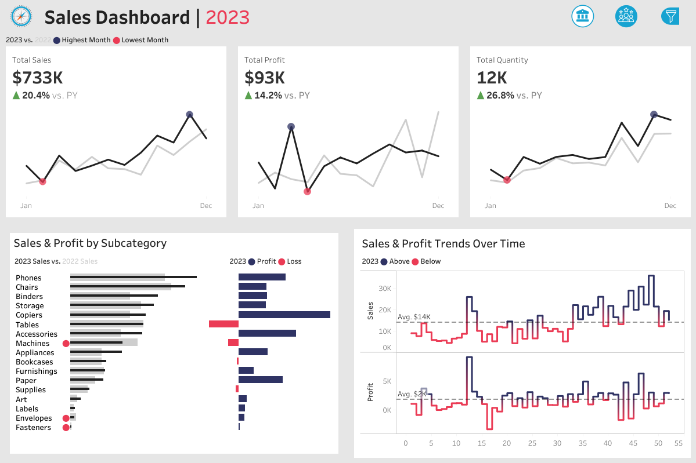
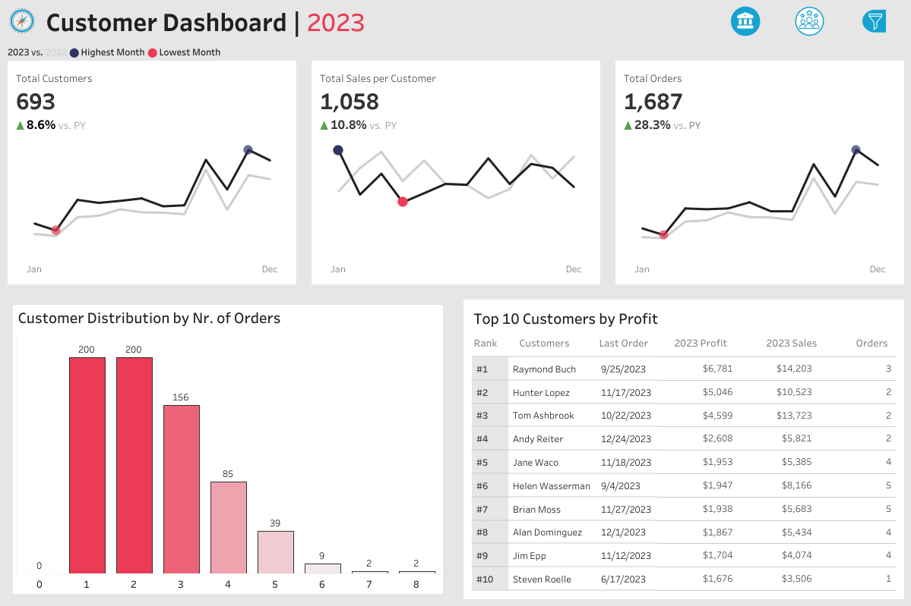
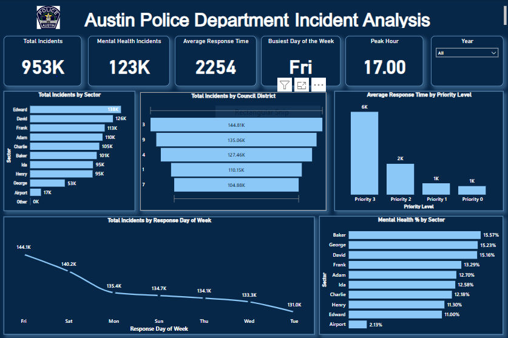
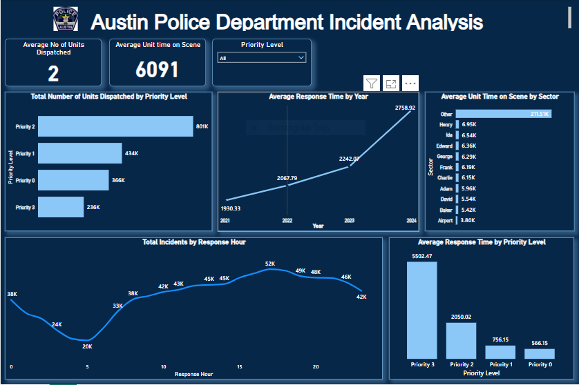

<!--Section 1: Introduce your self-->
## ABOUT ME

Hello! I'm Yetunde Kuti 🤓, a data analyst, with a passion for transforming complex datasets into meaningful insights. With extensive hands-on experience in Python, SQL, Excel, Tableau and Power BI, I specialize in leveraging data to solve real-world problems.

<!--Mention your top/relevant skills here - core and soft skills-->
## SKILLS

**- ✅ Data Analysis and Insights.**
Extracting, cleaning, and analyzing data to discover patterns and trends.

**- ✅ SQL and Database Management.**
Writing SQL queries to extract, manipulate and retrieve data from large datasets for analysis.

**- ✅ Data Visualization and Business Intelligence.**
Creating detailed dashboards and reports that propels decision-making.

**- ✅ Python for Data Analytics.**
Applying Python libraries such as Pandas, NumPy,and Matplotlib for data cleaning, analysis and visualization.

<!--Section 2: List 3-4 key projects-->
## MY PROJECTS 

*A glimpse of some of the projects I've been working on.*

**Superstore Sales Dashboard.**

The Sales Dashboard aims to provide actionable insights into Superstore's Sales's performance by tracking monthly and yearly sales trends and analyzing top-performing products to boost Revenue.

[Link to Dashboard](https://public.tableau.com/app/profile/yetundekuti/viz/SalesDashboardProject_17590734721390/SalesDashboard)

**Superstore Customer Dashboard.**

The Customer Dashboard aims to understand Customer data, purchase frequency and customer segmentation to identify high-value customers and improve customer satisfaction.

[Link to Dashboard](https://public.tableau.com/app/profile/yetundekuti/viz/SalesDashboardProject_17590734721390/SalesDashboard)

**Austin Police Department 911 Calls Analysis.**

In this Project, I assisted the Austin Police Department to reduce response time for High Priority calls, reduce allocation of units to low-priority calls and improve public safety.

[View Project](https://github.com/Yetty-code/Python-Portfolio-Projects/blob/master/Austin_Police_Dept_Project.ipynb)

[Link to Dashboard](https://app.powerbi.com/view?r=eyJrIjoiNTM1MjQwNDctNTNkOS00NzhhLThkMzItOGEzNGM1NDY5OTRjIiwidCI6ImMwNmRjMTY0LTY0OTYtNDhlOC04MDMwLTk2Yjc3N2Y5ZTAyMiJ9)

**Exploratory Data Analysis using FoodHub Dataset.**

In this project,I took the raw data and explored it using Python and this helped FoodHub delivery platform reduce delivery times,improve customer experience and maximize revenue.

[View Project](https://github.com/Yetty-code/Python-Portfolio-Projects/blob/master/Food_Hub_Project.ipynb)

**Austo Automobile Data Analysis.**

In this project, Austo's Automobile management team wanted to understand the demand of the buyers and trends in the US market. They want to build customer profiles based on the analysis to identify new purchase opportunities so that they can manipulate the business strategy and production to meet certain demand levels.

[View Project](https://github.com/Yetty-code/Python-Portfolio-Projects/blob/master/Austo_Project.ipynb)

**Retail Sales Data Analysis.**

This project performed exploratory data analysis,ranking and magnitude analysis,customer segmentation and report generation for a sales dataset using advanced SQL techniques.

[View EDA Project](https://github.com/Yetty-code/Retail-Sales-Data-Analysis/blob/main/SQL%20Queries)

## CONTACT DETAILS

*Let’s connect and see how we can make a difference together!*
<table>
  <tbody>
    <tr>
      <td>📧</td>
      <td><a href="mailto:abiolakuti1@gmail.com">abiolakuti1@gmail.com</a></td>
    </tr>
    <tr>
      <td>📞</td>
      <td>(234) 809-434-1936</td>
    </tr>
    <tr>
      <td>📍</td>
      <td>Lagos, Nigeria</td>
    </tr>
    <tr>
      <td>🌐</td>
      <td><a href="https://www.linkedin.com/in/yetunde-kuti/">LinkedIn Profile</a></td>
    </tr>
  </tbody>
</table>
